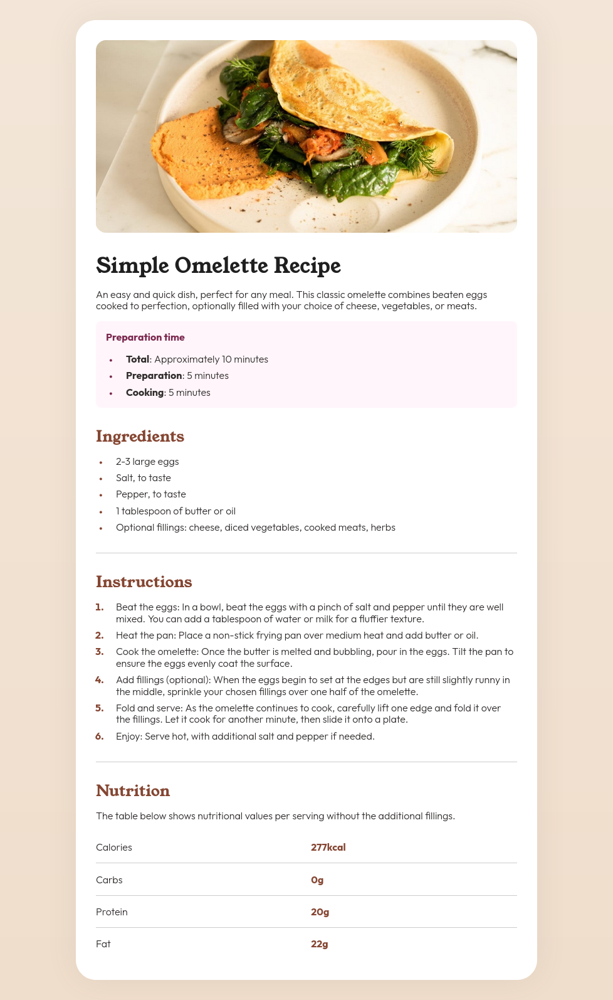

# Frontend Mentor - Recipe page solution

This is a solution to the [Recipe page challenge on Frontend Mentor](https://www.frontendmentor.io/challenges/recipe-page-KiTsR8QQKm). Frontend Mentor challenges help you improve your coding skills by building realistic projects.

## Table of contents

- [Overview](#overview)
  - [Screenshot](#screenshot)
  - [Links](#links)
- [My process](#my-process)
  - [Built with](#built-with)
  - [What I learned](#what-i-learned)
- [Author](#author)

## Overview

### Screenshot



### Links

- [Solution](https://github.com/msilenzi/frontend-mentor-challenges/tree/main/01-recipe-page)
- [Live Demo](https://msilenzi.github.io/frontend-mentor-challenges/01-recipe-page)

## My process

### Built with

- Semantic HTML5 markup
- CSS custom properties

### What I learned

I learned how to add opacity to colors defined with variables using `color-mix`:

```css
:root {
  --stone-600: hsl(30, 10%, 34%);
}

.main-container {
  box-shadow: 0 0 3rem color-mix(in hsl, var(--stone-600) 10%, transparent);
}
```

## Author

- [GitHub - msilenzi](https://github.com/msilenzi/)
- [Frontend Mentor - @msilenzi](https://www.frontendmentor.io/profile/msilenzi)
