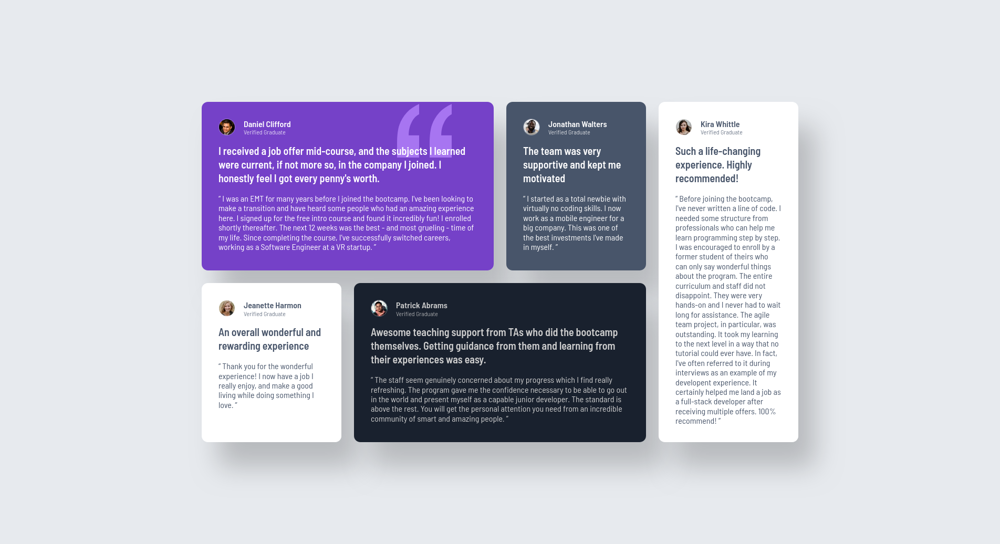

# Frontend Mentor - Testimonials grid section solution

This is a solution to the [Testimonials grid section challenge on Frontend Mentor](https://www.frontendmentor.io/challenges/testimonials-grid-section-Nnw6J7Un7). 

## Table of contents

- [Overview](#overview)
  - [The challenge](#the-challenge)
  - [Screenshot](#screenshot)
  - [Links](#links)
- [My process](#my-process)
  - [Built with](#built-with)
- [Author](#author)

## Overview

### The challenge

Users should be able to:

- View the optimal layout for the site depending on their device's screen size

### Screenshot

### Links

- [Solution](https://github.com/msilenzi/frontend-mentor-challenges/tree/main/05-testimonials-grid-section)
- [Live Demo](https://msilenzi.github.io/frontend-mentor-challenges/05-testimonials-grid-section)

## My process

### Built with

- Semantic HTML5 markup
- CSS custom properties
- CSS Grid
- Mobile-first workflow

## Author

- [GitHub - msilenzi](https://github.com/msilenzi/)
- [Frontend Mentor - @msilenzi](https://www.frontendmentor.io/profile/msilenzi)
